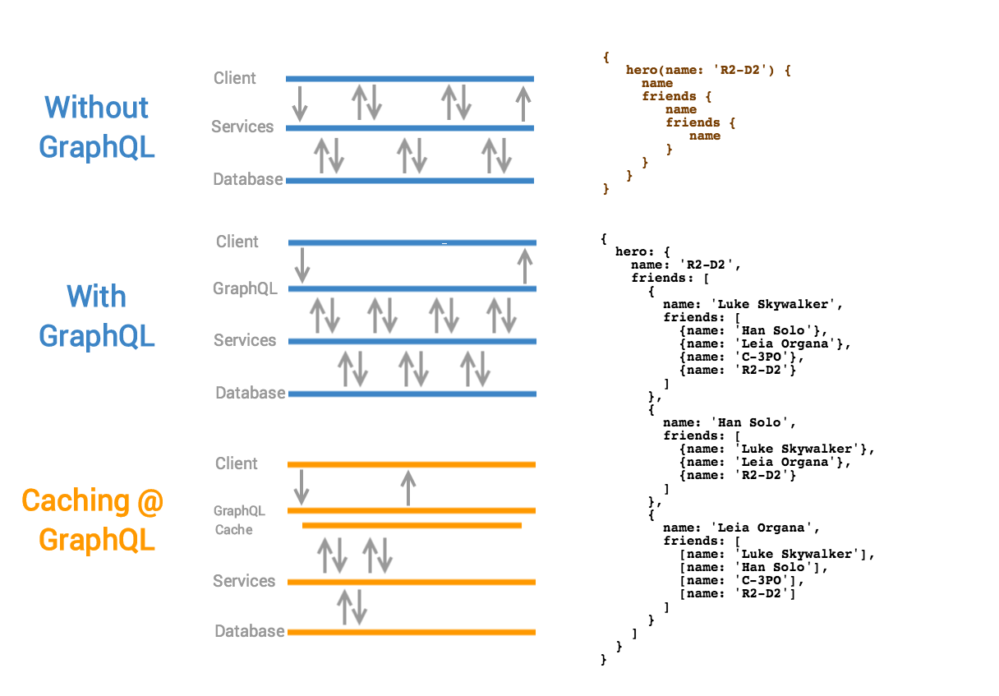

# G2QL - Geode GraphQL Extension

I have been questioning about GraphQL - “If GrpahQL is considered as a query language for APIs. Can this be a query language for a database?” - and the result is this library “*G2QL - Geode GraphQL Extension*”. 

Despite its name, GraphQL was not meant to be SQL for graph databases. Instead, GraphQL is an API query language developed by Facebook to improve the performance of interactions between a server and a client, such as a web browser or mobile app.

**GraphQL = Projection + Composition** for your APIs.
* **Projection** Client specifies what data fields it needs. Avoiding a predefined output format means that no unneeded data is sent, reducing the response transfer time to the necessary minimum.

* **Composition** Client can fetch multiple resources in a single query. Avoiding multiple back-to-back server requests means significantly less latency to complete loading data on the client.

## Why G2QL?
The same problems that GraphQL helps avoid in the client-server setting now arise between the server and the database.



While adding cache to GraphQL server is a natural solution, **G2QL** takes a reverse approach by adding GraphQL to a distributed cache.
 
G2QL is available as a jar and can be deployed to any Geode cache servers(or accessors), when deployed it introspects region configuration and creates GraphQL types for every Region.ValueConstraint and serves GraphQL endpoint from an embedded jetty server. 

Developer experience was key for GraphQL success and thus a goal for G2QL. G2QL plans to provide an OOB experience for Geode users by introspecting region and index configurations.
But in order to support object graphs (one-to-many eg: user -> friends, customer -> orders) users ca  annotate the fields so G2QL can infer and support nested object queries.

### G2QL Annotations

Users can use G2QL annotations to control introspection. Assuming user has a region /Person<String, Person>, then annotate the field to let G2QL infer the relationships.

```
class Person {
    String id;
    
    String name;
    
    @GeodeGraphQLConnection(region=“Person”)
    List<String> fiends; //store keys to person objects
}
```
### Roadmap:
 - add cache listener to keep GraphQL schema up-to-date
 - support mutations and subscriptions
 - introspect PDX types
 - introspect oql indexes
 - extend integrated security

### FAQs
- **Why is a server side extension?** Developers can build a micro service reading data through Geode Client APIs, G2QL is more of an out-of-box experience.
- **Why not OQL over developer REST APIs?** Using OQL, users can do projection + composition of multiple region data, but its not intuitive and there is no client libraries. GraphQL has hundreds of libraries in various languages.
- **Why not invoking a function over REST API (to do all the work and return the JSON)?** With G2QL, non-java app developers do not have to write geode functions.

## Getting Started

1. Build a shadow jar using gradle target `shadowJar`

    ```
    $ ./gradlew clean shadowJar
    
    ```
1. Deploy G2QL to any running Geode cacheserver
    ```
    gfsh> deploy geode-graphql-1.0.jar
    gfsh> execute function --id=graphql-init
    ```

### Running unit tests
```
./gradlew test
```
### Running integration tests

```
# downloads and starts locator and cacheserver
./gradlew start

# to run integration tests
./gradlew integrationTest
```

### Built With

* [graphql-java](https://github.com/graphql-java/graphql-java) - Java implementation of GraphQL Spec.

## License

This project is licensed under the Apache License 2.0 - see the [LICENSE](LICENSE) file for details
